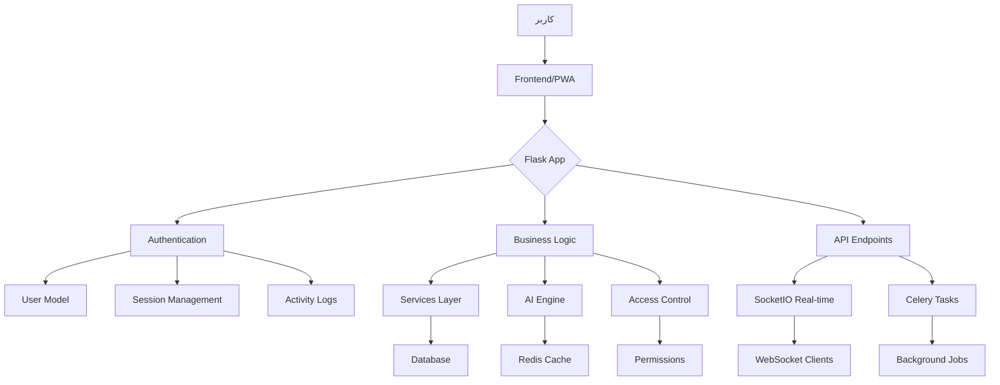

# 📊 گزارش جامع فنی و نقشه راه پیاده‌سازی متیما
## پلتفرم هوشمند تجارت بین‌الملل با رویکرد Social-First

---

## 🎯 خلاصه اجرایی (Executive Summary)

این سند یک تحلیل عمیق و جامع از پروژه **متیما (Metisma)** است که به عنوان یک **اکوسیستم هوشمند تجارت و تعامل** طراحی شده است. پروژه در حال حاضر دارای زیرساخت قدرتمندی است که ترکیبی از:

- **50% میزکار کاری (Workspace/CRM)**
- **25% شبکه اجتماعی تخصصی (Social Network)**
- **25% هوش مصنوعی تحلیلی (AI & Intelligence)**

را ارائه می‌دهد. این گزارش تمام جنبه‌های فنی، مدل‌های داده، مسیرهای API، تکنولوژی‌ها، و نقشه راه پیاده‌سازی ایده‌های جدید را پوشش می‌دهد.

---

## 📁 فصل 1: آمار و ارقام پروژه

### 1.1 ساختار کلی

| بخش | تعداد | توضیحات |
|-----|-------|----------|
| **فایل‌های Python** | 83+ | شامل مدل‌ها، routes، سرویس‌ها، utils |
| **مدل‌های داده‌ای** | 26+ | در 8 دسته‌بندی اصلی |
| **قالب‌های HTML** | 65+ | با طراحی Dark Luxury Tech |
| **Blueprint Routes** | 19+ | در 6 ماژول اصلی |
| **کتابخانه‌ها** | 40+ | در requirements.txt |

### 1.2 حجم کد

```
📦 مدل‌های داده:     ~4,500 خط کد
🛣️  Routes:          ~3,200 خط کد  
🎨 Templates:        ~8,000 خط کد
⚙️  Services:        ~2,800 خط کد
🔧 Utils & Config:   ~1,500 خط کد
━━━━━━━━━━━━━━━━━━━━━━━━━━━━━━
✅ مجموع تقریبی:    20,000+ خط کد
```

---

## 🏗️ فصل 2: معماری سیستم

### 2.1 دیاگرام لایه‌های معماری

```
┌─────────────────────────────────────────────────────────────┐
│                    Presentation Layer                        │
│  ┌─────────────┐  ┌─────────────┐  ┌─────────────────────┐  │
│  │   PWA       │  │   Admin     │  │   API Endpoints     │  │
│  │  Templates  │  │   Panel     │  │   (REST + SocketIO) │  │
│  └─────────────┘  └─────────────┘  └─────────────────────┘  │
└─────────────────────────────────────────────────────────────┘
                              ↓
┌─────────────────────────────────────────────────────────────┐
│                    Application Layer                         │
│  ┌─────────────┐  ┌─────────────┐  ┌─────────────────────┐  │
│  │   Flask     │  │  Celery     │  │   SocketIO          │  │
│  │   Routes    │  │  Tasks      │  │   Real-time         │  │
│  └─────────────┘  └─────────────┘  └─────────────────────┘  │
└─────────────────────────────────────────────────────────────┘
                              ↓
┌─────────────────────────────────────────────────────────────┐
│                    Business Logic Layer                      │
│  ┌─────────────┐  ┌─────────────┐  ┌─────────────────────┐  │
│  │  Services   │  │   AI        │  │   Access Control    │  │
│  │  (Core)     │  │  Engine     │  │   (RBAC + ABAC)     │  │
│  └─────────────┘  └─────────────┘  └─────────────────────┘  │
└─────────────────────────────────────────────────────────────┘
                              ↓
┌─────────────────────────────────────────────────────────────┐
│                    Data Access Layer                         │
│  ┌─────────────┐  ┌─────────────┐  ┌─────────────────────┐  │
│  │ SQLAlchemy  │  │   Redis     │  │   File Storage      │  │
│  │   ORM       │  │   Cache     │  │   (Local/S3)        │  │
│  └─────────────┘  └─────────────┘  └─────────────────────┘  │
└─────────────────────────────────────────────────────────────┘
                              ↓
┌─────────────────────────────────────────────────────────────┐
│                    Database Layer                            │
│              PostgreSQL (Primary) + SQLite (Dev)             │
└─────────────────────────────────────────────────────────────┘
```

### 2.2 جریان داده‌ها



---

## 🔧 فصل 3: تکنولوژی‌های استفاده‌شده

### 3.1 Backend Stack

| تکنولوژی | نسخه | کاربرد |
|----------|------|--------|
| **Python** | 3.11+ | زبان اصلی برنامه‌نویسی |
| **Flask** | 2.3.3 | فریم‌ورک وب |
| **SQLAlchemy** | 2.0.46 | ORM برای دیتابیس |
| **PostgreSQL** | - | دیتابیس اصلی (تولید) |
| **SQLite** | - | دیتابیس توسعه |
| **Redis** | - | کشینگ و صف پیام |
| **Celery** | 5.4.0 | پردازش ناهمگام |
| **Flask-SocketIO** | 5.3.6 | ارتباطات بلادرنگ |
| **Eventlet** | 0.41.0 | Async worker برای SocketIO |

### 3.2 Security & Auth

| کتابخانه | نسخه | کاربرد |
|----------|------|--------|
| **Flask-Login** | 0.6.3 | مدیریت جلسات کاربران |
| **Authlib** | 1.7.2 | OAuth2 و OpenID Connect |
| **cryptography** | 48.0.0 | رمزنگاری پیشرفته |
| **pyotp** | 2.9.0 | احراز هویت دو مرحله‌ای (2FA) |
| **Flask-ReCaptcha** | 0.4.2 | محافظت در برابر ربات‌ها |
| **Flask-Limiter** | 4.1.1 | Rate limiting |

### 3.3 Frontend & UI

| تکنولوژی | کاربرد |
|----------|--------|
| **Jinja2** | Template engine |
| **Tailwind CSS** | Styling (Dark Luxury Theme) |
| **Alpine.js** | Interactive UI components |
| **Chart.js** | نمودارها و ویژوالیزاسیون |
| **Leaflet.js** | نقشه‌های هوشمند |
| **PWA** | Progressive Web App |

### 3.4 Data & AI

| کتابخانه | کاربرد |
|----------|--------|
| **pandas** | تحلیل داده |
| **numpy** | محاسبات عددی |
| **scikit-learn** | Machine Learning (آماده‌سازی) |
| **openai** | یکپارچگی با GPT (کامنت‌شده) |

### 3.5 DevOps & Monitoring

| ابزار | کاربرد |
|-------|--------|
| **Gunicorn** | WSGI HTTP Server |
| **Flower** | مانیتورینگ Celery |
| **Flask-Migrate** | مدیریت Migration دیتابیس |
| **pytest** | Testing framework |
| **black, flake8** | Code formatting & linting |

---

## 📊 فصل 4: مدل‌های داده‌ای (Data Models)

### 4.1 دسته‌بندی مدل‌ها

#### 📌 گروه 1: احراز هویت و کاربران (Auth & Users)

| مدل | فایل | فیلدهای کلیدی | توضیحات |
|-----|------|--------------|-----------|
| **User** | `models/user.py` | username, email, role, trust_score, is_kyc_verified | هسته مرکزی سیستم کاربری |
| **UserProfile** | `models/user.py` | bio, specialization fields per role | پروفایل تخصصی بر اساس نقش |
| **Role** | `models/user.py` | 8 نقش تخصصی | PRODUCER, BUYER, BROKER, etc. |
| **MembershipTier** | `models/user.py` | FREE, VERIFIED, PREMIUM, ELITE | سطوح عضویت |
| **TrustScore** | `models/trust_score.py` | identity_score, expertise_score, social_score, dynamic_score | امتیاز اعتماد 4 بعدی (0-100) |
| **PasswordResetToken** | `models/auth.py` | token, expires_at, used | توکن بازیابی رمز عبور |
| **LoginSession** | `models/auth.py` | session_token, device_info, ip_address | مدیریت جلسات فعال |
| **ActivityLog** | `models/auth.py` | activity_type, success, ip_address | لاگ فعالیت‌های امنیتی |
| **TwoFactorBackupCode** | `models/auth.py` | code_hash, used | کدهای پشتیبان 2FA |
| **EmailVerificationToken** | `models/auth.py` | token, email, expires_at | تأیید ایمیل |

#### 📌 گروه 2: شبکه اجتماعی (Social Network)

| مدل | فایل | فیلدهای کلیدی | توضیحات |
|-----|------|--------------|-----------|
| **Post** | `models/social.py` | content, visibility, media, likes_count, tagged_products | پست‌های فید اخبار |
| **Comment** | `models/social.py` | content, parent_id, likes_count | کامنت‌ها با پشتیبانی از ریپلای |
| **Like** | `models/social.py` | target_type (post/comment), target_id | لایک پلی‌مورفیک |
| **Follow** | `models/social.py` | follower_id, following_id, connection_type | سیستم دنبال کردن |

#### 📌 گروه 3: نمایشگاه مجازی (Exhibition)

| مدل | فایل | فیلدهای کلیدی | توضیحات |
|-----|------|--------------|-----------|
| **Exhibition** | `models/exhibition/__init__.py` | title_fa/en, start_date, status, has_virtual_tour | مدیریت نمایشگاه‌ها |
| **Booth** | `models/exhibition/__init__.py` | owner_type/id, booth_number, 3d_model_url | غرفه‌های مجازی |
| **BoothVisit** | `models/exhibition/__init__.py` | visitor_type, duration_seconds, pages_viewed | بازدید از غرفه |
| **BoothInteraction** | `models/exhibition/__init__.py` | interaction_type, content, status | تعاملات غرفه |
| **BoothAppointment** | `models/exhibition/__init__.py` | scheduled_time, meeting_link, status | قرارهای ملاقات |
| **ExhibitionVisit** | `models/exhibition/__init__.py` | entry_time, booths_visited, device_info | بازدید کلی از نمایشگاه |

#### 📌 گروه 4: هوش تجاری و داده (Data Intelligence)

| مدل | فایل | فیلدهای کلیدی | توضیحات |
|-----|------|--------------|-----------|
| **MarketTrend** | `models/data_intelligence.py` | trend_type, metrics, confidence_level | روندهای بازار |
| **CompetitorAnalysis** | `models/data_intelligence.py` | strengths, weaknesses, threat_level | تحلیل رقبا |
| **DemandForecast** | `models/data_intelligence.py` | predicted_demand, confidence_interval, model_name | پیش‌بینی تقاضا با AI |
| **TradeStatistic** | `models/data_intelligence.py` | value, change_percent, breakdown | آمار تجاری کلان |
| **CustomReport** | `models/data_intelligence.py` | report_config, selected_fields, schedule | گزارش‌های سفارشی |
| **DataAlert** | `models/data_intelligence.py` | conditions, notification_channels | هشدارهای خودکار |

#### 📌 گروه 5: کنسرسیوم و سرمایه‌گذاری (Consortium & Investment)

| مدل | فایل | فیلدهای کلیدی | توضیحات |
|-----|------|--------------|-----------|
| **ConsortiumProject** | `models/consortium.py` | industry, target_country, estimated_value | پروژه‌های مشارکتی |
| **ConsortiumMember** | `models/consortium.py` | role, capital_share, profit_share | اعضای کنسرسیوم |
| **ConsortiumContract** | `models/consortium.py` | terms, responsibilities, signed_by | قرارداد هوشمند |
| **PartnerMatch** | `models/consortium.py` | match_score, match_reasons | پیشنهادات شریک هوشمند |

#### 📌 گروه 6: CRM و مدیریت لید (Lead Management)

| مدل | فایل | فیلدهای کلیدی | توضیحات |
|-----|------|--------------|-----------|
| **Lead** | `models/lead.py` | company_name, pipeline_stage, deal_value, lead_score | سرنخ‌های فروش |
| **LeadInteraction** | `models/lead.py` | interaction_type, channel, outcome | تعاملات با لید |
| **LeadTask** | `models/lead.py` | task_type, due_date, is_completed | وظایف مرتبط |
| **Campaign** | `models/lead.py` | campaign_type, objective, budget, conversions | کمپین‌های بازاریابی |
| **CampaignLead** | `models/lead.py` | status, engagement_score | ارتباط لید با کمپین |
| **CampaignAnalytics** | `models/lead.py` | sent, opened, clicked, converted | تحلیل کمپین |
| **EmailTemplate** | `models/lead.py` | subject, content, variables | قالب‌های ایمیل |
| **AutomationRule** | `models/lead.py` | trigger_type, conditions, actions | قوانین اتوماسیون |

#### 📌 گروه 7: تجارت و معاملات (Trading)

| مدل | فایل | فیلدهای کلیدی | توضیحات |
|-----|------|--------------|-----------|
| **Product** | `models/product.py` | name, hs_code, price, inventory | محصولات |
| **Order** | `models/order.py` | status, total_amount, incoterms | سفارشات خرید |
| **TradeCredit** | `models/trade_credit.py` | credit_limit, interest_rate, repayment_terms | اعتبار تجاری |
| **Wallet** | `models/wallet.py` | balance, currency, transactions | کیف پول دیجیتال |

#### 📌 گروه 8: خدمات و یکپارچگی (Services & Integration)

| مدل | فایل | فیلدهای کلیدی | توضیحات |
|-----|------|--------------|-----------|
| **Provider** | `models/provider.py` | service_type, rating, availability | ارائه‌دهندگان خدمات |
| **Integration** | `models/integration.py` | api_key, webhook_url, is_active | یکپارچگی با سرویس‌های خارجی |
| **Notification** | `models/notification.py` | title, message, is_read, notification_type | سیستم اعلان |
| **Message** | `models/message.py` | content, is_read, conversation_id | پیام‌رسانی |
| **AIChat** | `models/ai_chat.py` | query, response, context | چت با هوش مصنوعی |

---

## 🛣️ فصل 5: Routes و Endpoints

### 5.1 Blueprintها

| Blueprint | مسیر پایه | فایل | توضیحات |
|-----------|----------|------|----------|
| **users** | `/users` | `routes/users/` | مدیریت کاربران، پروفایل، KYC |
| **social** | `/social` | `routes/social/` | شبکه اجتماعی، فید، پست‌ها |
| **exhibition** | `/exhibition` | `routes/exhibition/` | نمایشگاه مجازی، غرفه‌ها |
| **trading** | `/trading` | `routes/trading/` | معاملات، سفارشات، محصولات |
| **admin** | `/admin` | `routes/admin/` | پنل مدیریت، مجوزها |
| **magazine** | `/magazine` | `routes/magazine/` | مجله آموزشی، مقالات |

### 5.2 Endpoints کلیدی

#### 👤 کاربران (Users)

```
GET  /users/profile                 # پروفایل کاربری
GET  /users/dashboard               # داشبورد شخصی
POST /users/login                   # ورود
POST /users/logout                  # خروج
POST /users/register                # ثبت‌نام
POST /users/kyc/submit              # ارسال مدارک KYC
GET  /users/documents               # مشاهده مدارک
GET  /users/activity-log            # لاگ فعالیت‌ها
POST /users/enable-2fa              # فعال‌سازی 2FA
GET  /users/sessions                # مدیریت جلسات فعال
```

#### 📱 شبکه اجتماعی (Social)

```
GET  /social/feed                   # فید اخبار شخصی‌سازی‌شده
GET  /social/profile/<username>     # پروفایل عمومی
POST /social/follow/<user_id>       # دنبال کردن کاربر
POST /social/unfollow/<user_id>     # آنفالو
POST /social/post/create            # ایجاد پست جدید
GET  /social/post/<post_id>         # مشاهده پست
POST /social/post/<post_id>/like    # لایک پست
POST /social/post/<post_id>/comment # افزودن کامنت
GET  /social/followers/<user_id>    # لیست فالوورها
GET  /social/following/<user_id>    # لیست فالووینگ‌ها
```

#### 🏢 نمایشگاه (Exhibition)

```
GET  /exhibition/hall               # تالار نمایشگاه
GET  /exhibition/booth/<id>         # جزئیات غرفه
POST /exhibition/booth/<id>/visit   # ثبت بازدید
POST /exhibition/booth/<id>/interact # تعامل با غرفه
POST /exhibition/booth/<id>/appoint # قرار ملاقات
```

#### 💼 معاملات (Trading)

```
GET  /trading/products              # لیست محصولات
POST /trading/orders                # ثبت سفارش
GET  /trading/orders/<id>           # جزئیات سفارش
GET  /trading/wallet                # کیف پول
POST /trading/payment               # پرداخت
```

#### 🔐 مدیریت (Admin)

```
GET  /admin/dashboard               # داشبورد مدیریت
GET  /admin/users                   # مدیریت کاربران
GET  /admin/permissions             # مدیریت مجوزها
POST /admin/kyc/approve             # تأیید KYC
GET  /admin/activity-logs           # لاگ‌های سیستم
```

---

## 🎨 فصل 6: Design System و UI

### 6.1 پالت رنگی (Dark Luxury Tech)

```css
/* رنگ‌های اصلی */
--gold: #D4AF37;          /* طلایی اصلی */
--gold-dark: #B8941F;     /* طلایی تیره */
--gold-light: #E8C858;    /* طلایی روشن */

/* تم تاریک */
--dark-900: #0A0A0F;      /* پس‌زمینه اصلی */
--dark-800: #12121A;      /* کارت‌ها */
--dark-700: #1A1A2E;      /* عناصر ثانویه */
--dark-600: #252542;      /* Borders */

/* رنگ‌های وضعیت */
--success: #10B981;       /* سبز موفقیت */
--warning: #F59E0B;       /* نارنجی هشدار */
--danger: #EF4444;        /* قرمز خطا */
--info: #3B82F6;          /* آبی اطلاعات */
```

### 6.2 تایپوگرافی

```
Font Family: 'Inter', system-ui, sans-serif
Font Sizes:  xs(12px), sm(14px), base(16px), lg(18px), xl(20px), 2xl(24px)
Weights:     300(Light), 400(Regular), 500(Medium), 600(SemiBold), 700(Bold)
```

### 6.3 کامپوننت‌های کلیدی

- **کارت‌های لوکس**: گرادینت طلایی، سایه‌های نرم، انیمیشن hover
- **نشان‌های Trust Score**: Platinum 🏆, Gold 🥇, Silver 🥈, Bronze 🥉
- **فید بی‌پایان**: Infinite scroll با لودینگ اسکلتونی
- **داشبورد تعاملی**: نمودارهای Chart.js، ویجت‌های قابل تنظیم
- **پروفایل عمومی**: SEO-friendly، قابل مشاهده بدون لاگین

---

## 🔒 فصل 7: امنیت و دسترسی‌ها

### 7.1 لایه‌های امنیتی

```
Layer 1: Authentication
├── Password Hashing (bcrypt)
├── 2FA (TOTP + Backup Codes)
├── Session Management
└── Login Session Tracking

Layer 2: Authorization (RBAC + ABAC)
├── Role-Based Access Control (8 نقش)
├── Permission-Based Access Control
├── Resource-Level Permissions
└── Dynamic Access Rules

Layer 3: Protection
├── Rate Limiting (Flask-Limiter)
├── CSRF Protection (Flask-WTF)
├── XSS Prevention
├── SQL Injection Prevention (SQLAlchemy ORM)
└── ReCaptcha v3

Layer 4: Data Security
├── Encryption at Rest
├── HTTPS Enforcement
├── Secure Headers
└── Activity Logging
```

### 7.2 نقش‌های کاربری (8 نقش تخصصی)

| نقش | کد | توضیحات | دسترسی‌های ویژه |
|-----|-----|----------|-----------------|
| **تولیدکننده/صادرکننده** | `producer` | تولیدکنندگان کالا | مدیریت محصولات، سفارشات صادراتی |
| **واردکننده/خریدار** | `buyer` | واردکنندگان | جستجوی محصولات، ثبت سفارش |
| **کارگزار تجاری** | `broker` | واسطه‌های تجاری | matchmaking، کمیسیون |
| **نماینده شرکتی** | `corporate_agent` | نمایندگان شرکت‌ها | مدیریت چندگانه |
| **خدمات لجستیک** | `logistics` | حمل‌ونقل و بیمه | ارائه خدمات لجستیکی |
| **خدمات حقوقی** | `legal` | وکلا و مشاوران | مشاوره حقوقی، انطباق |
| **شریک فناوری** | `tech_partner` | شرکت‌های فناوری | یکپارچگی API |
| **سرمایه‌گذار** | `investor` | سرمایه‌گذاران مالی | دسترسی به فرصت‌های سرمایه‌گذاری |
| **مدیر سیستم** | `admin` | مدیریت پلتفرم | دسترسی کامل |
| **ناظر محتوا** | `moderator` | نظارت بر محتوا | تأیید/رد محتوا |

### 7.3 سطوح عضویت (Membership Tiers)

| سطح | نام | مزایا | محدودیت‌ها |
|-----|-----|-------|------------|
| **FREE** | رایگان | پروفایل پایه، دسترسی محدود | عدم دسترسی به ویژگی‌های premium |
| **VERIFIED** | تأیید شده | KYC تکمیل، اعتماد بالاتر | نیاز به تأیید مدارک |
| **PREMIUM** | ویژه | تمام ابزارها، اولویت در نتایج | هزینه ماهانه/سالانه |
| **ELITE** | نخبگان | پشتیبانی VIP، نشان ویژه | دعوت‌نامه یا شرایط خاص |

---

## 🚀 فصل 8: ویژگی‌های کلیدی

### 8.1 زنجیره اعتماد هوشمند (Trust Chain) ⭐ **نقطه درخشان**

```
┌─────────────────────────────────────────────────────────┐
│              Trust Score Multi-Dimensional              │
│                                                         │
│  Identity Verification (0-25 امتیاز)                    │
│  ├── مدارک ثبت شرکت                                    │
│  ├── تأیید هویت دو مرحله‌ای                             │
│  └── ایمیل و تلفن تأیید شده                            │
│                                                         │
│  Expertise Verification (0-25 امتیاز)                   │
│  ├── گواهی‌نامه‌های محصول                               │
│  ├── سابقه صادرات/واردات                               │
│  └── تخصص صنعتی                                        │
│                                                         │
│  Social Score (0-25 امتیاز)                             │
│  ├── نظرات مثبت                                        │
│  ├── معاملات موفق                                      │
│  └── تعاملات اجتماعی                                   │
│                                                         │
│  Dynamic Score (0-25 امتیاز)                            │
│  ├── سرعت پاسخگویی                                     │
│  ├── دقت تحویل                                         │
│  └── رفتار در پلتفرم                                   │
│                                                         │
│  Total: 0-100 → Badge: Newcomer → Bronze → Silver → Gold → Platinum │
└─────────────────────────────────────────────────────────┘
```

### 8.2 KYC تعاملی و سینمایی

- **مرحله 1**: آپلود مدارک با Drag & Drop
- **مرحله 2**: تأیید هویت ویدیویی (در آینده)
- **مرحله 3**: بررسی هوشمند با AI
- **مرحله 4**: تأیید نهایی توسط ادمین
- **نمایش وضعیت**: Real-time با انیمیشن

### 8.3 میزکار هوشمند (Smart Workspace)

```
┌─────────────────────────────────────────────────────────┐
│                  Smart Dashboard                        │
│                                                         │
│  ┌──────────────┐  ┌──────────────┐  ┌──────────────┐  │
│  │  CRM Leads   │  │ AI Content   │  │ Analytics    │  │
│  │  Pipeline    │  │ Generator    │  │ Charts       │  │
│  │              │  │              │  │              │  │
│  │ • Lead Score │  │ • Auto-write │  │ • Revenue    │  │
│  │ • Follow-up  │  │ • Email temp │  │ • Conversion │  │
│  │ • Tasks      │  │ • Product desc│ │ • Trends     │  │
│  └──────────────┘  └──────────────┘  └──────────────┘  │
│                                                         │
│  ┌──────────────┐  ┌──────────────┐  ┌──────────────┐  │
│  │  Orders      │  │ Messages     │  │ Trust Score  │  │
│  │  Management  │  │  & Chat      │  │  Monitor     │  │
│  └──────────────┘  └──────────────┘  └──────────────┘  │
└─────────────────────────────────────────────────────────┘
```

### 8.4 شبکه اجتماعی چندلایه

- **Public Posts**: قابل مشاهده توسط همه (SEO)
- **Followers Only**: فقط برای فالوورها
- **Connection Based**: فقط برای کانکشن‌های تأیید شده
- **Private**: فقط برای کاربران خاص

### 8.5 نمایشگاه مجازی ساده ولی جذاب

- **غرفه‌های 2D/3D**: با امکان تور مجازی
- **ویدیو کنفرانس**: قرارهای ملاقات آنلاین
- **لید جنریشن**: جمع‌آوری اطلاعات بازدیدکنندگان
- **آمار لحظه‌ای**: تعداد بازدید، تعاملات

### 8.6 جذب سرمایه (Investment Hub)

- **پروژه‌های کنسرسیومی**: مشارکت چندجانبه
- **Partner Matching**: پیشنهاد شریک هوشمند
- **قرارداد هوشمند**: توزیع سود و سرمایه
- **Investor Dashboard**: پیگیری سرمایه‌گذاری‌ها

---

## 📝 فصل 9: نقشه راه پیاده‌سازی ایده‌های جدید

### 9.1 فاز 1: تقویت KYC و احراز هویت (2-3 هفته)

#### ✅ کارهای موجود:
- مدل‌های `PasswordResetToken`, `LoginSession`, `ActivityLog`
- فیلدهای `is_kyc_verified`, `kyc_documents_url` در User
- صفحات `upload_documents.html`, `my_documents.html`

#### 🔧 نیاز به توسعه:
1. **KYC مراحل چندگانه**:
   ```python
   class KYCStage(db.Model):
       - stage_number (1-4)
       - status (pending, in_review, approved, rejected)
       - documents[]
       - reviewer_comments
       - completed_at
   ```

2. **بررسی هوشمند مدارک با AI**:
   - یکپارچگی با OCR (Google Vision یا Azure)
   - استخراج خودکار اطلاعات از مدارک
   - تطبیق با اطلاعات وارد شده

3. **احراز هویت ویدیویی**:
   - ضبط ویدیو کوتاه کاربر
   - مقایسه با عکس مدارک (Face Recognition)
   - ذخیره در سیستم امن

4. **صفحه وضعیت KYC**:
   - Progress bar زیبا
   - نمایش مرحله فعلی
   - زمان تقریبی بررسی

### 9.2 فاز 2: ارتقای میزکار به CRM کامل (3-4 هفته)

#### ✅ کارهای موجود:
- مدل‌های `Lead`, `LeadInteraction`, `LeadTask`, `Campaign`
- پایپ‌لاین فروش با 6 مرحله
- اتوماسیون بازاریابی

#### 🔧 نیاز به توسعه:
1. **داشبورد CRM بصری**:
   - Kanban board برای Leadها
   - نمودار قیف فروش (Funnel)
   - تقویم تعاملات

2. **تولید محتوا با AI**:
   ```python
   class AIContentGenerator:
       def generate_email(self, lead_data, template_type):
           # استفاده از OpenAI API
           pass
       
       def generate_product_description(self, product_features):
           pass
       
       def generate_proposal(self, lead, products):
           pass
   ```

3. **یکپارچگی ایمیل**:
   - ارسال ایمیل مستقیم از CRM
   - Tracking باز شدن ایمیل
   - قالب‌های هوشمند

4. **گزارش‌گیری پیشرفته**:
   - Export به Excel/PDF
   - گزارش‌های دوره‌ای خودکار
   - Dashboards قابل تنظیم

### 9.3 فاز 3: شبکه اجتماعی پیشرفته (2-3 هفته)

#### ✅ کارهای موجود:
- مدل‌های `Post`, `Comment`, `Like`, `Follow`
- Routes کامل برای فید، پروفایل، تعاملات
- Templates: `feed.html`, `profile.html`, `_post_card.html`

#### 🔧 نیاز به توسعه:
1. **الگوریتم فید هوشمند**:
   ```python
   def get_personalized_feed(user_id, limit=50):
       # وزن‌دهی بر اساس:
       # - Trust Score نویسنده
       # - تعاملات قبلی
       # - تازگی پست
       # - محتوای برگزیده
       pass
   ```

2. **گروه‌ها و جوامع تخصصی**:
   ```python
   class SocialGroup(db.Model):
       - name, description
       - owner_id (creator)
       - members[] (with roles: admin, moderator, member)
       - privacy (public, private, invite_only)
       - industry_tag
   ```

3. **دسترسی‌های لایه‌ای**:
   - شرکت‌های بزرگ → پروفایل Verified با نشان ویژه
   - دسترسی‌های متفاوت بر اساس Trust Score
   - محتوای Premium فقط برای اعضا

4. **اعلان‌های بلادرنگ**:
   - SocketIO برای نوتیفیکیشن لحظه‌ای
   - Push notifications برای PWA
   - Email digest روزانه/هفتگی

### 9.4 فاز 4: هوش مصنوعی تحلیلی (4-6 هفته)

#### ✅ کارهای موجود:
- مدل‌های `MarketTrend`, `DemandForecast`, `CompetitorAnalysis`
- ساختار JSONB برای داده‌های پیچیده

#### 🔧 نیاز به توسعه:
1. **موتور پیشنهاد هوشمند**:
   ```python
   class AIRecommendationEngine:
       def recommend_partners(self, user):
           # بر اساس صنعت، کشور، تخصص
           pass
       
       def suggest_products(self, buyer):
           # بر اساس تاریخچه جستجو و خرید
           pass
       
       def predict_market_trends(self, product_category):
           # Time series forecasting
           pass
   ```

2. **چت‌بات هوشمند**:
   - پاسخ به سوالات متداول
   - راهنمایی در پلتفرم
   - یکپارچگی با OpenAI GPT

3. **تحلیل احساسات**:
   - بررسی نظرات و کامنت‌ها
   - تشخیص رضایت مشتری
   - هشدار به مدیران

4. **پیش‌بینی تقاضا**:
   - مدل‌های Machine Learning
   - داده‌های تاریخی + عوامل خارجی
   - سناریوهای مختلف

### 9.5 فاز 5: نمایشگاه و جذب سرمایه (3-4 هفته)

#### ✅ کارهای موجود:
- مدل‌های `Exhibition`, `Booth`, `ConsortiumProject`
- Routes نمایشگاه

#### 🔧 نیاز به توسعه:
1. **غرفه‌ساز بصری**:
   - Drag & Drop builder
   - قالب‌های آماده
   - آپلود چندرسانه‌ای

2. **سیستم قرار ملاقات**:
   - تقویم یکپارچه
   - Zoom/Google Meet integration
   - یادآوری خودکار

3. **پلتفرم کنسرسیوم**:
   - ایجاد پروژه مشارکتی
   - دعوت از شرکا
   - مذاکره آنلاین
   - امضای دیجیتال قرارداد

4. **داشبورد سرمایه‌گذار**:
   - پیگیری سرمایه‌گذاری‌ها
   - سود تقسیمی
   - گزارش عملکرد

---

## 🎯 فصل 10: نقاط درخشان پیشنهادی

### 🏆 نقطه درخشان 1: **زنجیره اعتماد هوشمند (Trust Chain)**

**چرا می‌درخشد؟**
- ترکیب 4 بعدی از اعتماد (هویتی، تخصصی، اجتماعی، پویا)
- نشان‌های بصری جذاب (Platinum, Gold, Silver, Bronze)
- تأثیر مستقیم بر دسترسی‌ها و اولویت‌ها
- ایجاد انگیزه برای فعالیت بیشتر

**پیاده‌سازی:**
- هم‌اکنون در مدل `TrustScore` موجود است
- نیاز به UI جذاب برای نمایش امتیاز
- الگوریتم‌های به‌روزرسانی خودکار
- یکپارچگی با تمام بخش‌های پلتفرم

---

### 🌟 نقطه درخشان 2: **KYC سینمایی و تعاملی**

**چرا می‌درخشد؟**
- تجربه کاربری منحصر به فرد در احراز هویت
- کاهش نرخ ریزش در فرآیند ثبت‌نام
- ایجاد حس حرفه‌ای بودن و امنیت
- تمایز از رقبا

**پیاده‌سازی:**
- Progress indicator زیبا
- انیمیشن‌های smooth بین مراحل
- بازخورد لحظه‌ای
- گیمیفیکیشن (badge برای تکمیل هر مرحله)

---

### 💡 نقطه درخشان 3: **تولید محتوا با AI در CRM**

**چرا می‌درخشد؟**
- صرفه‌جویی در زمان کاربران
- افزایش کیفیت ارتباطات
- مزیت رقابتی واقعی
- جذب کسب‌وکارهای کوچک

**پیاده‌سازی:**
- یکپارچگی با OpenAI API
- قالب‌های هوشمند برای ایمیل، پیشنهاد، توضیح محصول
- شخصی‌سازی بر اساس لحن برند
- یادگیری از بازخوردها

---

## 📋 فصل 11: چک‌لیست اقدامات فوری

### 🔴 اولویت بالا (هفته 1-2)

- [ ] تکمیل مدل `KYCStage` برای مراحل چندگانه
- [ ] طراحی UI صفحه وضعیت KYC با Progress Bar
- [ ] بهبود الگوریتم فید با Trust Score
- [ ] اضافه کردن گروه‌های تخصصی به شبکه اجتماعی
- [ ] ایجاد dashboard CRM با نمودارها

### 🟡 اولویت متوسط (هفته 3-4)

- [ ] یکپارچگی OCR برای بررسی مدارک
- [ ] تولید محتوا با AI (ایمیل، توضیح محصول)
- [ ] سیستم اعلان بلادرنگ با SocketIO
- [ ] گزارش‌گیری پیشرفته با Export
- [ ] بهبود صفحات پروفایل عمومی (SEO)

### 🟢 اولویت پایین (هفته 5-8)

- [ ] احراز هویت ویدیویی
- [ ] غرفه‌ساز بصری برای نمایشگاه
- [ ] موتور پیشنهاد هوشمند
- [ ] چت‌بات پشتیبانی
- [ ] پلتفرم کامل کنسرسیوم

---

## 🛠️ فصل 12: فایل‌های کلیدی برای ویرایش

### برای تقویت KYC:
```
✏️ models/user.py              # اضافه کردن فیلدهای KYC
✏️ models/auth.py              # توکن‌های تأیید
➕ models/kyc.py               # مدل جدید برای مراحل KYC
✏️ routes/users/routes.py      # endpointهای KYC
✏️ templates/users/upload_documents.html  # UI آپلود
➕ templates/users/kyc_status.html        # صفحه وضعیت
```

### برای ارتقای CRM:
```
✏️ models/lead.py              # کامل‌تر کردن Lead
➕ services/ai_content.py      # سرویس تولید محتوا
✏️ routes/users/dashboard.py   # داشبورد CRM
➕ templates/users/crm_dashboard.html
➕ templates/users/kanban_board.html
```

### برای شبکه اجتماعی:
```
✏️ models/social.py            # اضافه کردن Groups
✏️ routes/social/routes.py     # endpoints گروه‌ها
✏️ templates/users/feed.html   # الگوریتم فید
➕ templates/users/groups.html
➕ templates/users/group_detail.html
```

### برای هوش مصنوعی:
```
➕ services/ai_engine.py       # موتور هوش مصنوعی
➕ services/recommendations.py # سیستم پیشنهاد
✏️ models/data_intelligence.py # مدل‌های جدید
➕ routes/ai/routes.py         # endpoints AI
```

---

## 📊 فصل 13: معیارهای موفقیت (KPIs)

### برای KYC:
- ✅ نرخ تکمیل فرآیند KYC (>70%)
- ✅ زمان متوسط بررسی مدارک (<48 ساعت)
- ✅ نرخ رد مدارک (<15%)

### برای شبکه اجتماعی:
- ✅ میانگین زمان صرف‌شده در پلتفرم (>15 دقیقه/روز)
- ✅ نرخ تعامل (لایک، کامنت، شیر) (>10%)
- ✅ تعداد پست‌های روزانه (>100)

### برای CRM:
- ✅ نرخ تبدیل لید به مشتری (>20%)
- ✅ تعداد ایمیل‌های ارسالی از پلتفرم
- ✅ رضایت کاربران از ابزارهای AI (>4/5)

### برای Trust Score:
- ✅ میانگین امتیاز کاربران (>60)
- ✅ درصد کاربران Platinum/Gold (>20%)
- ✅ همبستگی Trust Score با معاملات موفق

---

## 🎓 فصل 14: منابع و مستندات

### مستندات داخلی:
- `TECHNICAL_MASTER_PLAN.md` - نقشه فنی کامل
- `CONTEXT_MASTER_BRIEF.md` - brief پروژه
- `docs/` - مستندات تکمیلی

### کتابخانه‌های مفید:
- **OpenCV** - پردازش تصویر برای KYC
- **Transformers (Hugging Face)** - NLP برای تحلیل احساسات
- **Prophet** - پیش‌بینی سری‌های زمانی
- **Stripe API** - پرداخت‌ها (در صورت نیاز)

### APIهای خارجی:
- **OpenAI GPT** - تولید محتوا
- **Google Vision** - OCR مدارک
- **Twilio** - SMS verification
- **SendGrid** - ایمیل‌های تراکنشی

---

## ✍️ نتیجه‌گیری

پروژه **متیما** یک پلتفرم جامع و پیشرفته است که پتانسیل بالایی برای تبدیل شدن به یک **اکوسیستم پیشرو در تجارت بین‌الملل** دارد. با تمرکز بر سه محور اصلی:

1. **اعتماد و شفافیت** (Trust Chain + KYC)
2. **تعامل و شبکه‌سازی** (Social Network + Groups)
3. **هوشمندی و بهره‌وری** (AI Tools + CRM)

می‌توان تجربه‌ای منحصر به فرد برای کاربران ایجاد کرد که هم **حرفه‌ای** است و هم **زنده و پویا**.

### توصیه نهایی:
با **فاز 1 (KYC)** شروع کنید، زیرا سنگ بنای اعتماد در پلتفرم است. سپس به ترتیب فازهای 2 و 3 را اجرا کنید تا کاربران هم ابزارهای کاری داشته باشند و هم حس زنده بودن پلتفرم را تجربه کنند.

---

**تهیه شده توسط:** دستیار هوشمند متیما  
**تاریخ:** 2026  
**نسخه:** 1.0  

---

*این سند زنده است و باید به مرور به‌روزرسانی شود.*
